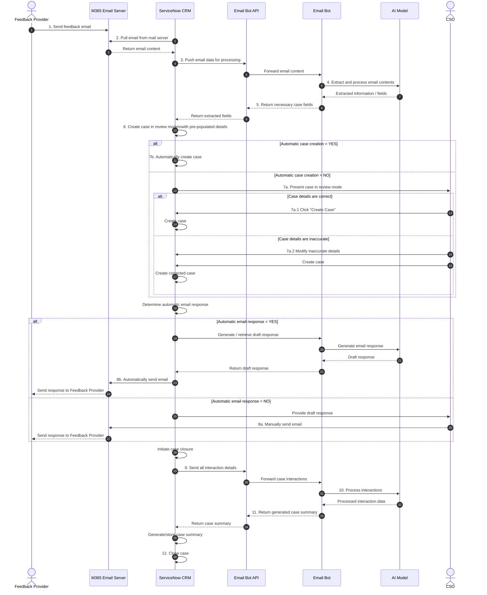
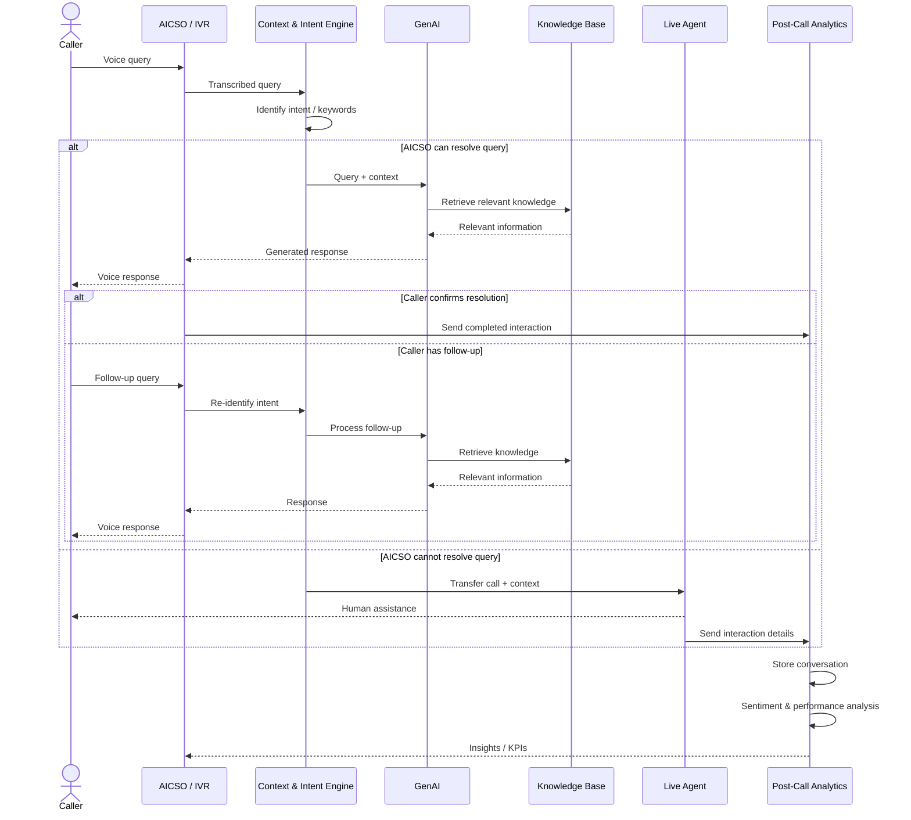

# Architecting a proof-of-concept Generative AI enterprise knowledge assistant in AWS
> A working version of an email bot and a voice bot which can identify the case category of the incoming enquiry, and for those cases that are identified to be simple and straightforward, a draft response with reference to the knowledge base is generated. The underlying models are continuously re-trained with reviews of the model outputs.

1. [Problem Statement](#problem-statement)
2. [Business Opportunity](#business-opportunity)
3. [Solution](#solution)
4. [AWS High Level Design](#aws-high-level-design)
5. [Security Overview](#security-overview)
6. [User Acceptance Test](#user-acceptance-testing)
7. [Evaluation Metrics using RAGAS](#evaluation-metrics-using-ragas-framework)
8. [Business Outcomes](#business-outcomes)

## Problem Statement
The Customer Contact Centre Division is on a continuous transformational journey to reinvent the ways of working and deliver better services to citizens. The business seeks to embark on this journey which leverages the benefits of automation and artificial intelligence to boost its First Call Resolution (FCR) rate, while improving agent productivity and realizing operational efficiency savings.

## Business Opportunity
* Customer Experience
    * Queries are attended and responded more promptly which is increasing the overall customer satisfaction.
    
* Operational Efficiency
    * Customer Service Officers (CSO) are able to focus their efforts on complex cases, therefore improving productivity.
    
* Operational Costs
    * The CSO team can be leaner, reducing manpower overhead costs.
 
## Solution
1. Email Bot
> An automated workflow system can categorize and address inbound email inquiries encompassing diverse categories, providing self-service for simple cases and seamlessly escalating complex ones to the appropriate team.

2. Voice Bot 
> An integrated solution with Amazon Connect that generates responses using relevant information within the knowledge base and delivers the responses in an appropriate tone with support for multiple languages back to the caller.

## AWS High Level Design

1. Voice Bot 
* Utilizing Voice BOT, callers receive tailored responses aligned with their inquiries, determined by identified intent (keywords). 
The integration of Amazon Lexv2 with Connect facilitates seamless delivery of these responses through voice communication channels.
2. Email Bot 
* Agents will have access to an intuitive interface enabling them to craft email responses tailored to specific scenarios, drawing from a comprehensive knowledge base. 
This user-friendly web application will be hosted on `EndUser` VPC for seamless accessibility.
3. Generative AI Services 
* The system boasts the flexibility to harness the power of our existing model, allowing for fine-tuning to accommodate diverse use cases, leveraging frontier LLMs such as Claude Sonnet.
In addition to the resources outlined, any supplementary resources will be shared between existing [Enterprise Data Hub](/analytics/AWS_EnterpriseDataHub.md) use cases. Access controls will be implemented within these services. 
4. Permission Boundaries 
* Infrastructure-level access and encryption protocols will be implemented, while network configurations and developer access will remain consistent across both domains.

## Email Bot Sequence Diagram

## Voice Bot Sequence Diagram

## Security Overview
* Automated Pipeline
    * Implementing an automated pipeline to update the KBs as needed, ensuring they are always current and relevant.

* Unified Knowledge Base for Email and Voice Bot
    * Developing a single Knowledge Base that can serve both Email and Voice BOT, potentially extending its utility to multiple use cases or additional channels in the future.

* Isolated AWS Resources
    * Utilizing separate AWS resources for this solution to avoid any impact on the existing Enterprise Data Hub workload, while leveraging established patterns and designs to facilitate Technical Architecture (TA) and Technical Risk Assessment (TRA) discussions.

* Security Controls
    * Implementing stringent security controls by segregating the infrastructure within the same AWS account. This includes creating separate authentication and authorization mechanisms, data stores, and other relevant components to ensure data integrity and confidentiality.

## User Acceptance Testing
**Step 1:** Split data into Calibration and Test 
Sets
* Divide dataset (potentially text or prompts) into subsets related to GenAI solution calibration, validation and testing. It helps to understand how your solution will perform on unseen data and what its generalization performance is.

**Step 2:** Test data for Bias and Fairness
* Ensure that a solution does not exhibit bias or unfair discrimination. Design testing to work across demographic groups and analyse data to identify potential biases.

**Step 3:** Mitigate imbalanced dataset
* Optimize solution with data with resampling techniques applied - under sample or oversample dataset or use synthetic data. 

**Step 4:** Calibrate GenAI
* Adjust hyperparameters and calibrate the prompt. 

**Step 5:** Performance Metrics
* Various metrics are used to evaluate the solution’s performance, depending on the problem type. Define what the KPIs and quantitative metrics are. 

**Step 6:** Test Set Metrics
* When evaluating a solution, it's important to look at how it performs on the testing set. It helps identify the solution's strengths and weaknesses.

**Step 7:** Human (Key user) feedback
* Often GenAI  solutions solve complex and sophisticated problems or are used for creative content generation, where definition of quantitative metrics is hard. Human feedback and domain expertise might be crucial in a development phase to allow for evaluation of the solution.

## Evaluation Metrics using RAGAS framework
* **Faithfulness:** How factually accurate is the generated answer against the retrieved context?
* **Answer Relevancy:** How relevant is the generated answer to the question?
* **Context Precision:** The signal to noise ratio of retrieved context
* **Context Recall:**: Can it retrieve all the relevant info required to answer the user query?

#### Target Score: **70%** across all 4 metrics

## Business Outcomes

| Customer Experience | Operational Efficiency | Operational Costs |
| --- | --- | --- |
| Reduction in Handling Time | Right Resources & Information through integrated data | Long term optimization of human workforce on CC |
Higher Quality of responses | Improved SLA for resolution | Drive agent behavior change with in-the-moment guidance and with post call analysis |
Collection of Online Feedback and Identity unhappy customers to resolve issues proactively | Productivity gain for complex cases and human focus tasks | Automated post call analysis |

