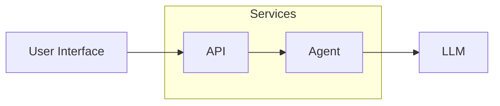
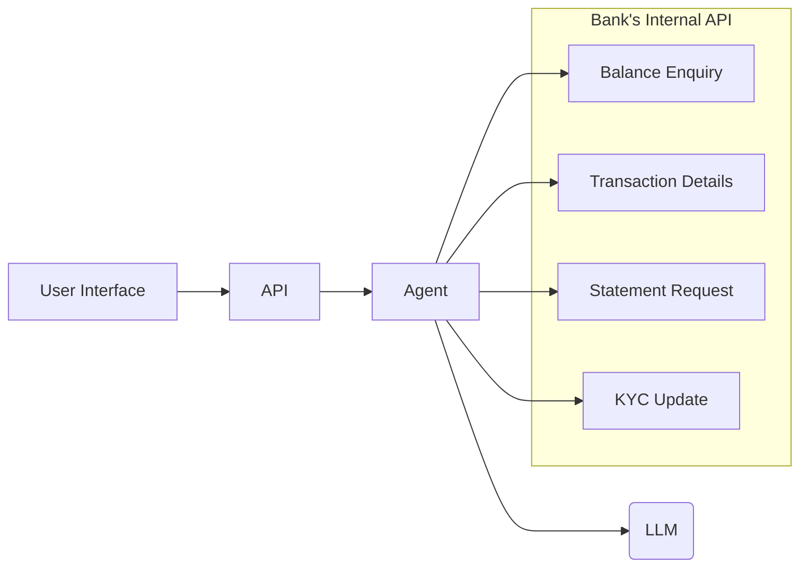
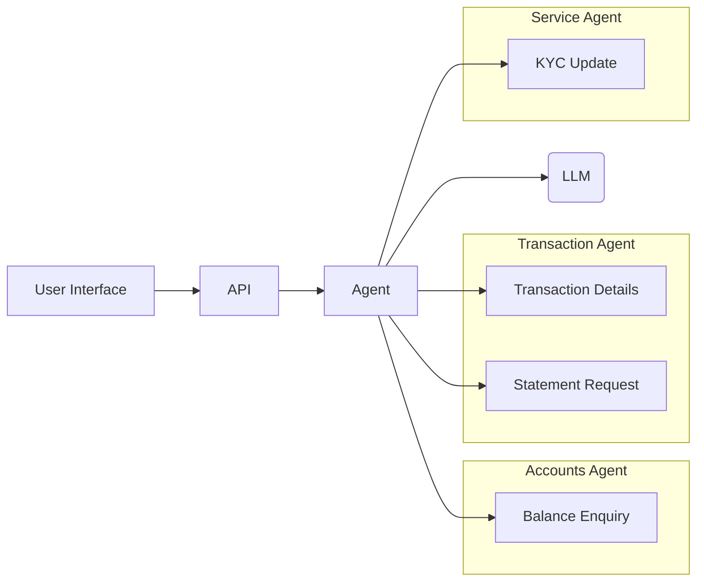
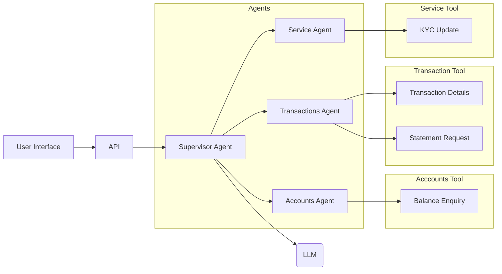
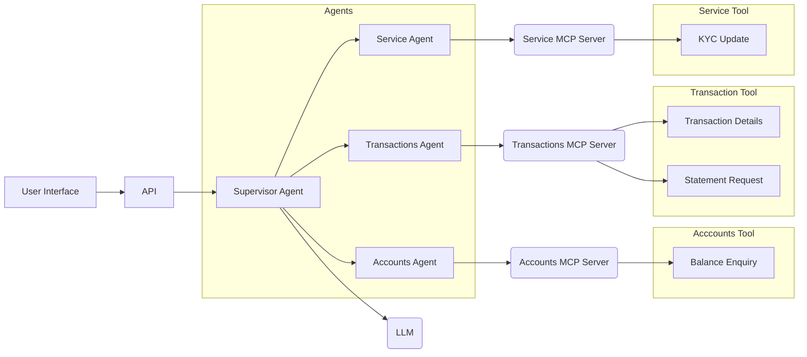
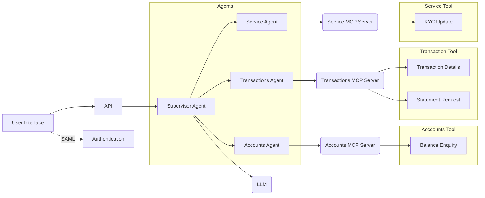

# Building a Production Grade Agentic AI Blueprint (BFSI)
> Enabling a Agentic Banking application from demo to production at scale

1. [Context](#context)
2. [Problem Statement](#problem-statement)
3. [Agentic AI Blueprint](#full-scale-agentic-ai-blueprint)
4. [Step 1: Demo and Proof-of-Concept](#step-1-demo-and-proof-of-concept)
5. [Step 2: Enabling Agent access to the Bank's API ](#step-2-enabling-the-agent-access-to-the-banks-internal-data-through-apis)
6. [Step 3: Introduce Domain-specific Agents](#step-3-create-domain-specific-sub-agents-and-assign-only-those-tools-it-needs-access-to)

## Context
A bank's customer service lead has reported that 300,000 calls were made last month

75% of them asked three questions:
* What's is my balance?
* What was this debit from my account?
* Send me cheque book

## Problem Statement
* Average call handling time, four minutes
* Every year bank pays millions of dollars to the network provider

But the bank's mobile and web app already has all of this. Why are they still calling?

Because the app has multiple screens and some of the customers don't know how to navigate these screens to find out what they need. So they will find it easier to ask their questions to a customer support person over a call. 

## Full Scale Agentic AI Blueprint

#### Step 1: Demo and Proof-of-Concept

#### Step 2: Enabling the agent access to the bank's internal data through APIs

#### Step 3: Create domain specific sub agents and assign only those tools it needs access to 

#### Step 4: Who decides which agent answers?

#### Step 5: Expose tools via MCP servers to create a loosely coupled design

#### Step 6: Authentication

#### Step 7: Authorization

#### Step 8: AI v Software Engineering

#### Step 9: Memory and State Management

#### Step 10: PII Never Leaves the Bank

#### Step 11: Agent Evaluation Suite

#### Step 12: AgentOps (Monitoring & Observability)

#### Step 13: FinOps (Cost Management)

#### Step 14: Defense in Depth (Edge Layer Security)