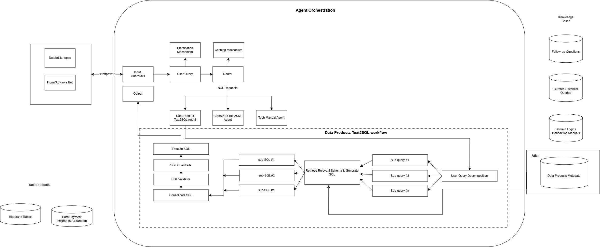
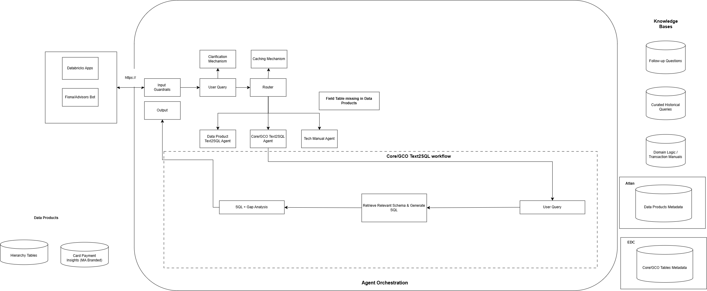

# Agentic Data Translator
> A natural-language analytics agent that enables Product and Ops Teams to query in English and the system is able to generate the correct answers

## Table of Contents
1. [Problem Statement](#problem-statement)
2. [Business Opportunity](#business-opportunity)
3. [Solution](#solution)
4. [Solutions Architecture](#solutions-architecture)
5. [Technical Stack](#technical-stack)
6. [Business Outcomes](#business-outcomes)

## Problem Statement
* 3500+ business users and data analysts depend on specialist-served analytics
* 2.0m ad-hoc SQL queries / year across the organization
* Enterprise analytics today requires SQL / data specialist support, creating 2+ business day delays before users can access actionable insights

## Business Opportunity
* Shift analysts time from query chasing to decision-making
* Enable data analysts to directly explore data, interpret results, and answer business questions without needing to understand backend schemas, tables or SQL logic

## Solution
* Agentic Data Translator (Text2SQL) for governed self-served analytics
* Natural language chat interface that generate schema-aware SQL, retrieves data faster, reduces inconsistent query logic, and creates the foundation for conversational analytics across business units

1. A multi-agent data assistant to solve
    * High cost of analytics: Too much time spent translating business into SQL
    * High complexity: Even a small number of tables can be extremely complex (e.g 800 columns)
    * Discoverability gap and accelerating time-to-insights

2. Data Products
	* NLQ --> SQL generation for Data Products
	* Executes SQL on Databricks and returns results
	* Data Products are pre-aggregated and simpler --> improves reliability and adoption

3. Core/GCO Tables
	* Used to understand what exists in Core/GCO
	* Helps identify "What's available today? vs What's in Data Products?"
	* Support data discovery and roadmap alignment

4. Answers questions like 
	* Do we have X attributes/metric in Data Products today? If not, is it available in Core/GCO? Which table/field?

5. Tech Manuals
	* Answers definition questions about data elements/sub-fields
	* Replace manual lookups in 1000+ page technical manuals

6. Answer questions about meaning and definition
	* What does this data element represent in business terms?
How should I interpret this field for reporting?

## Solutions Architecture

#### SQL Querying for Data Products

#### SQL Querying for Core Products/GCO

* Demo and Minimum Viable Product
* Guardrail Implementation (Credential and Output Validation Layer)
* Clarification Mechanism
* Caching Mechanism
* Role-based and attribute-based access control
* User Query Decompositiion

## Technical Stack
* **Data Warehouse**: Databricks Lakebase
* **Agentic Workflow**: Databricks Mosaic AI
* **Metadata Management**: Atlan
* **Caching**: Redis
* **Object Storage**: Delta Lake Tables

## Business Outcomes
* Estimated saving of ~900k of analyst hours spent of writing/debugging SQL, $2X.YM/year in productivity cost, and ~$XM/year in Hadoop compute
* Saved  ~12,2XX hours annually by reducing manual ad-hoc query writing and onboarded 75 users
* 14.XM+ productivity opportunity at 35% efficiency gain
* 504 queries processed
* Active feedback loop driving SQL validation and continuous model improvement

[Back To Top](#table-of-contents)