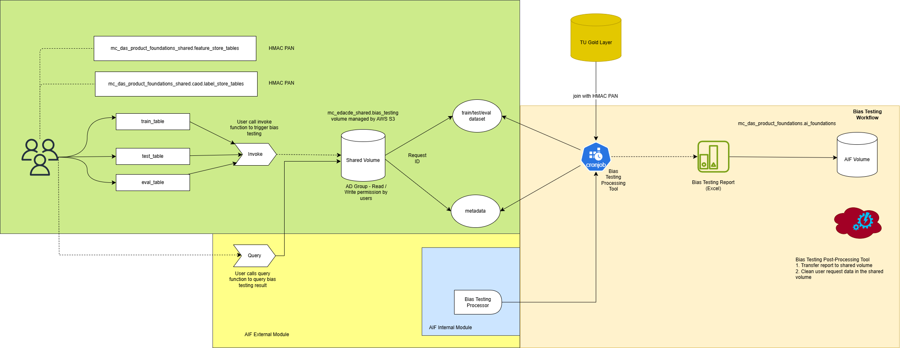
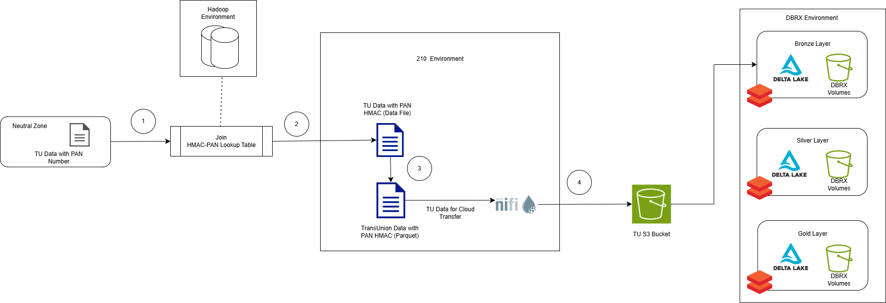

# Bias Detection Toolkit in Databricks
> Enabling data scientists and AI engineers to evaluate machine learning and generative AI applications for bias outputs against verified demographic sources in the public cloud environment.

## Table of Contents
1. [Problem Statement](#problem-statement)
2. [Solution](#solution)
3. [Bias Testing Process](#bias-testing-process)
4. [Bias Testing on Databricks Architecture](#bias-testing-on-databricks-architecture-blueprint)
5. [Tech Stack](#tech-stack)

## Problem Statement
Models on Databricks must perform bias testing in the Databricks environment to the organization's data responsiblity principles. Due to data privacy and PDP compliance restriction, users are not allowed to access or directly analyze TransUnion data on Databricks

## Solution 
The Bias Testing SDK deployed on Databricks ensures that: 

* Sensitive data remains protected while allowing necessary fairness analysis
* Bias testing can be integrated into model development workflows seamlessly in the cloud
* User are compliant with the organization governance framework without violating access restrictions on TransUnion datasets
* Overall compliance with EU AI Act

 ### Bias Testing Pipeline (AWS-Native)
 * Step Functions
    * Gives visual state tracking, retry/error handling per step, auditability at each stage of pipeline
 * Lambda Functions
    * Invokes pipeline to generate bias testing reults on a CRON schedule
* AWS Glue
   * Peform complex data transformation with encrypted and TransUnion data 

## Bias Testing Process

## Bias Testing On Databricks Architecture Blueprint

**Step 1:** The user initiates the bias testing process by invoking the designated function and submitting the input parameters, which are then stored in a specified AWS S3 bucket

**Step 2:** Upon receiving the input parameters, the development team triggers an internal workflow. This involves joining the user-provided train, test and validation datasets based on account numbers with corresponding account numbers from the TU dataset. The TU dataset can only be accessible for AI Foundations team.

**Step 3:** A bias testing analysis is then conducted. Once completed, the resulting bias testing report is generated and stored in the same S3 bucket as Step 1

**Step 4:** The user retrieves the results by invoking the bias testing query function, which accesses the S3 bucket to fetch the completed bias testing report. The report will be residing inside the AWS S3 bucket up to 1 year as a storage lifecycle policy.

## Tech Stack
* **Platform**: Databricks
* **Database**: PostgreSQL
* **Object Storage**: Simple Storage Service (S3)
* **Tables**: Delta Lake Tables

[Back To Top](#table-of-contents)