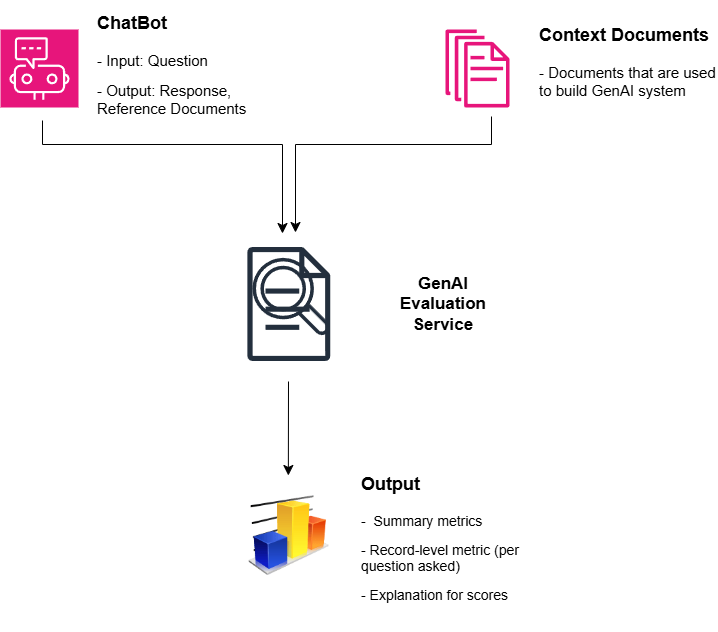
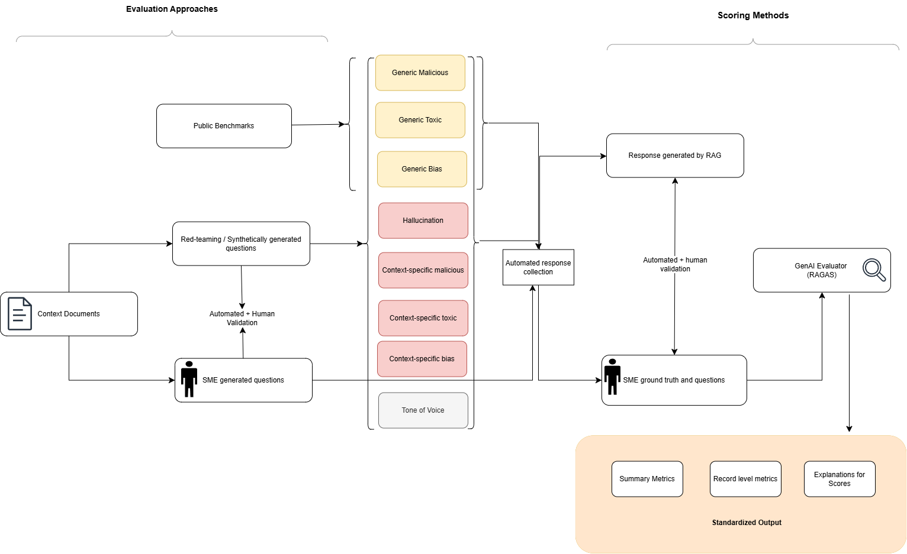
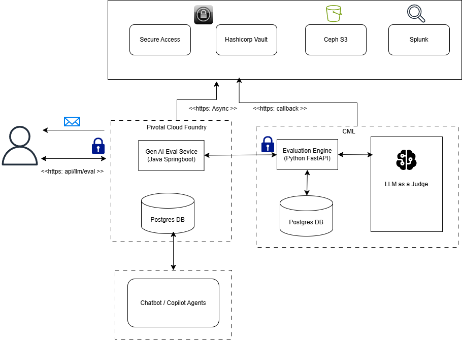

# Generative AI Evaluation Service
> An evaluation suite to detect conversational agents and chatbot for AI risk such as hallucination, harm, inappropriate usage and bias. Integrates with tone-of-voice evaluator to identify inappropriate outputs and overall agent behavior.

## Table of Contents
1. [Problem Statement](#problem-statement)
2. [Solution](#solution)
3. [GenAI Eval Suite Workflow](#genai-evaluation-workflow)
4. [GenAI Solutions Architecture](#genai-evaluation-service-reference-architecture)
5. [Technical Stack](#technical-stack)
6. [Outcomes from Red-Teaming and Drift Checks](#outcomes-from-red-teaming-and-drift-checks)

## Problem Statement
#### A major fintech company has seen a surge in GenAI adoption over the past 3 years

**Trust & Safety Gaps**

* Low-code / no-code tools enable fast deployment but bypass traditional governance
* Developers lack actionable insights during build-time to detect and mitigate risks
* Lack of standardized evaluation
Manual testing may be resource-intensive and inconsistent

## Solution
* An evaluation service for developers and engineers to identify AI risks such as hallucination, harm, inappropriate usage

## GenAI Evaluation High Level Design

1. Input Questions, Output Responses and Reference Documents evaluated for AI risks.
2. Context documents such as system prompts to build the GenAI system are also evaluated.

## GenAI Evaluation Workflow

## GenAI Evaluation Service Reference Architecture

## Technical Stack
* **Frontend**: Springboot in PCF 
* **Backend**: FastAPI and Claude Sonnet
* **Object Storage**: Ceph S3
* **Encryption**: Hashicorp Vault, Secure Access
* **Observability**: Splunk and Dynatrace in Elastic Kubernetes Service

## Outcomes from Red-Teaming and Drift Checks
Moderate / high risk were detected for:
* Refusal of context-specific harmful and inappropriate usage attack prompts
* Moonshot toxicity and jailbreak datasets

Testing Outcome (Copilot Agents) - Democratizing AI while ensuring Risks are managed

* Almost all generic attack prompts were detected and refused by content filter
* Lower refusal rate for context-specific attack prompts but the responses are low toxicity
* ChatBot in production has a low refusal rate,  and responses are detected to be promoting maliciousness

[Back To Top](#table-of-contents)