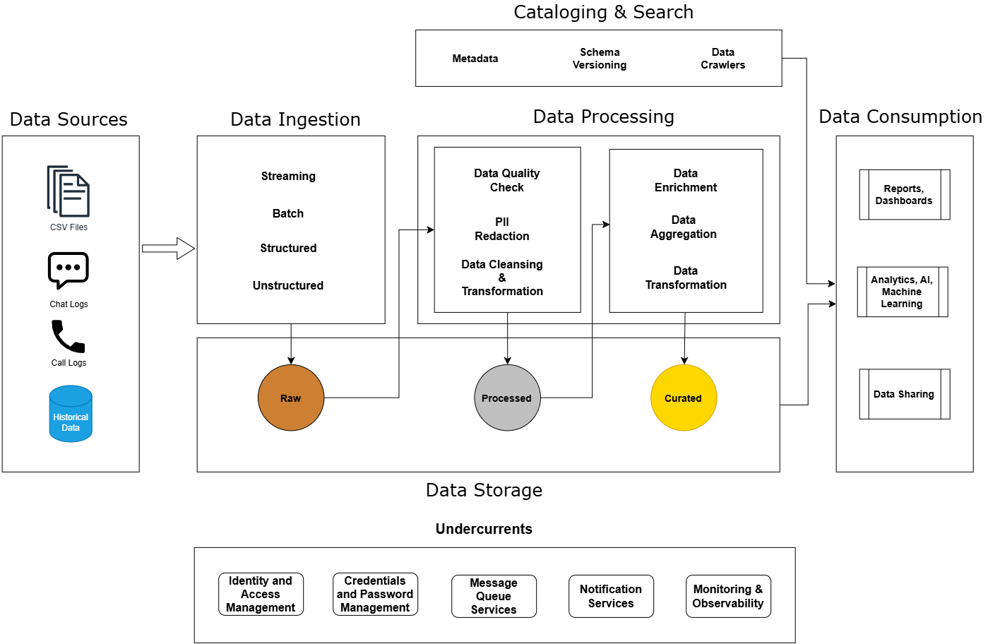
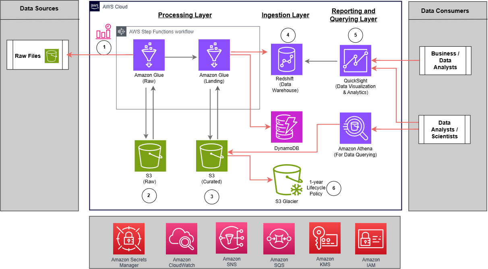
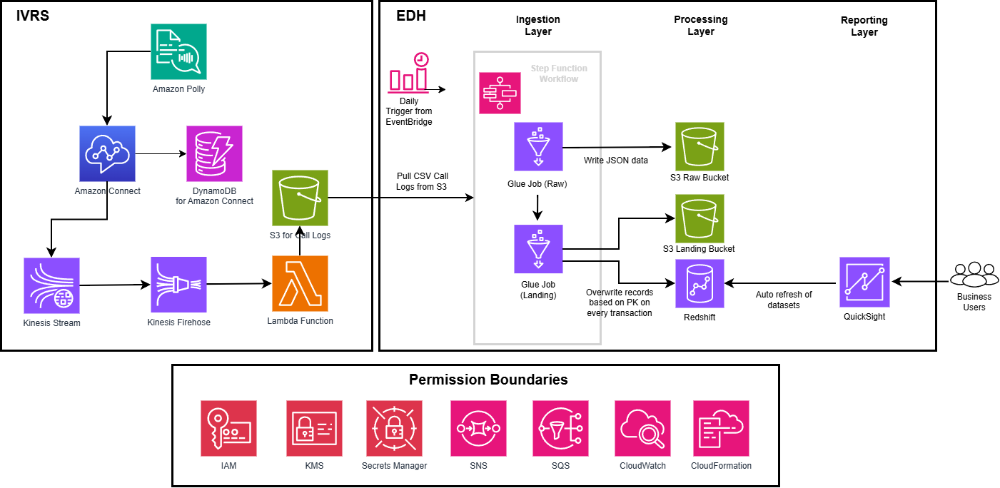
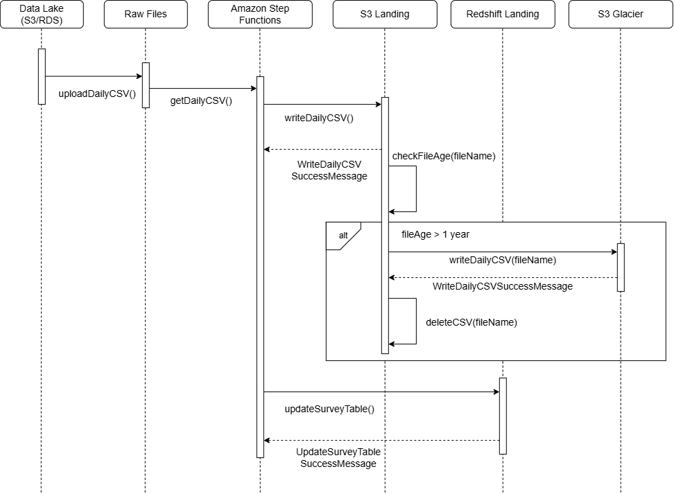

# Enterprise Data Hub in AWS 
> A unified analytics platform for service delivery and insights managers to retrive accurate north-star metrics on a monthly and quarterly basis and drive actionable insights to improve customer contact centre experience

## Table of Contents
1. [Problem Statement](#problem-statement)
2. [Business Opportunity](#business-opportunity)
3. [Solution](#solution)
4. [High Level Design](#high-level-design)
5. [Context Diagram](#context-diagram)
6. [Context Diagram for Call Channels](#context-diagram-for-call-channels)
7. [Architecture Trade Offs](#architecture-trade-offs)
8. [Sequence Diagram](#sequence-diagram)
9. [Business Outcomes](#business-outcomes)
10. [Points of Failure and Mitigation](#points-of-failure-and-mitigation)

## Problem Statement
* Data points are fragmented from various sources such as PDFs, chatbot and call logs
* Critical KPIs are required to be updated with both historical data from legacy platform and new data from incumbent cloud platform. 
* ~50,000 cases/month from various channels such as physical walk-ins, emails, web portal, call stream and interactive chatbot.  

## Business Opportunity
1. Create a one-stop data analytics platform where users can generate and view reports from a single source of truth
2. Address discoverability gap and accelerating time-to-insights
3. Enable management to obtain a 360 view of contact centre operations


## Solution
1. Integrate data sources into a single data lake.
2. Data processing job will be automated and event-driven leveraging message queues and event buses.
3. Data is ingested from isolated virtual private cloud (VPC) accounts to accomodate air-gapped network architecture.
4. PII information will be encrypted to SHA-256 UUID during migration to accomomdate data residency requirements.

## High Level Design


* Collect data from multiple formats and channels
* Keep original data before processing
* Validate, cleanse, and transform before reporting
* Separate raw, processed, and reporting-ready data
* Give analysts flexible access to trusted datasets
* Protects access, credentials, and operations across the flow


## Context Diagram


1. **Step Functions and EventBridge**:Daily trigger of batch job
2. **AWS Glue**:1st Job stores into an object storage for original data
3. **AWS Glue**:2nd Job stores into another object storage for process data
4. **Redshift and DynamoDB**:New data points are mapped to tables in Data Warehouse and metadata is stored in non-relational DB
5. **QuickSight and Athena**:Dashboards and query engines are refreshed with the new data points
6. **S3 Glacier**: 1-year lifecycle policy to archive data as cold storage
7. **Simple Queue Service**: FIFO Message queue system allowing business users to upload their flat files in order
8. **Simple Notification Service**: Send notifications to user's emails for successful ingestion batch jobs and manual uploads

## Context Diagram for Call Channels


1. **Polly**
2. **Amazon Connect**
3. **Kinesis Streams**
4. **Kinesis Firehose**

## Architecture Trade-Offs
* Batch trades freshness for simpler, predictable processing
* Data quality checks reduce incomplete or inconsistent reporting
* S3 preserves original data; lifecycle policies * manage storage cost
* Amazon Redshift provides governed reporting; Athena supports flexible analysis
* Role-based access separates business, analyst and admin responsibilities
* Monitoring, metadata and notifications support reliable operations


## Sequence Diagram


```
Business view: Schedule → Process → Validate → Store → Report → Explore
```

## Business Outcomes
* 40 operational dashboards containing critical KPIs recreated in new analytics platform ensuring minimal disruption
* Service delivery and operation managers have role-based access to dashboards
* Enabled business units that require manual uploads of datasets are ingested into a single point of access.
* Annual training for newly onboarding operation managers as part of business continuity planning 

## Points of Failure and Mitigation
| Failure | Impact | Mitigation |
| --- | --- | --- |
| API Timeout during batch ingestion | Incomplete data in dashboards | Delete partial data from latest batch job and retrigger pipeline ingestion |
| Ingestion of daily CSV files are incomplete | Missing or incomplete data in dashboards | Check under the failure directory of the S3 Curated Bucket for missing data points, delete incomplete batch of data ingestion and retrigger the pipeline as of previous date |

[Back To Top](#table-of-contents)