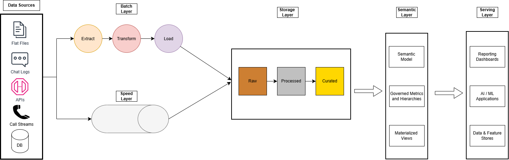

# Lambda Architecture in Snowflake 
> Data Engineering platform for real-time and batch processing for supply chain management. Senior management wish to explore opportunities to embed generative and agentic AI capabilities into existing applications. 

## Problem Statement
Supply chain managers requires a reporting platform to gain a 360 view of business operations and monitor critical north-star metrics such as Shipment Volume and Customer Experience.

## Business Requirements
1. Requires real-time analytics view of supply chain management activities
2. Requires management reporting dashboard to view quarterly statistics such as customer satisfaction and net promoter scores

## High Level Design

## Technical Stack
* **Platform:**: Snowflake
* **Storage**: Apache Iceberg Tables
* **Stream Processing**: Apache Kafka
* **Data Transformation**: dbt
* **Orchestration**: Apache Airflow
* **Data Visualization**: Tableau