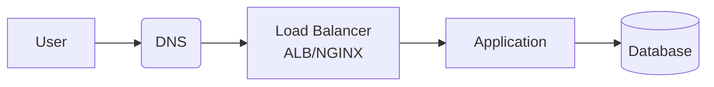

# Simple Web Application Architecture

```mermaid
flowchart LR
    A[User]
    B(DNS)
    C[Load Balancer </br> ALB/NGINX]
    D[Application]
    E[(Database)]

    A --> B
    B --> C
    C --> D
    D --> E
```

## Request Flow
* Shows how a user request move through the system
* In this example: User -> DNS -> Load Balancer -> Application -> Database